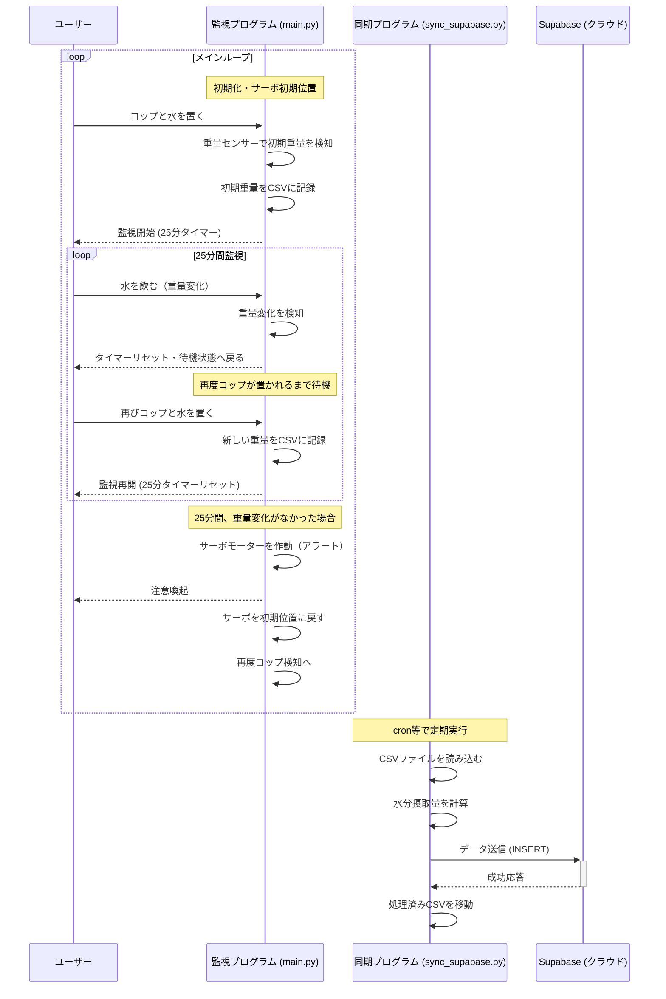

# システム動作のシーケンス図

```mermaid
sequenceDiagram
    participant User as ユーザー
    participant Main as 監視プログラム (main.py)
    participant Sync as 同期プログラム (sync_supabase.py)
    participant Supabase as Supabase (クラウド)

    %% ① 監視ループ（main.py） %%
    loop メインループ
        Note over Main: 初期化・サーボ初期位置
        User->>+Main: コップと水を置く
        Main->>Main: 重量センサーで初期重量を検知
        Main->>Main: 初期重量をCSVに記録
        Main-->>User: 監視開始 (25分タイマー)

        loop 25分間監視
            User->>+Main: 水を飲む（重量変化）
            Main->>Main: 重量変化を検知
            Main-->>User: タイマーリセット・待機状態へ戻る
            Note over Main: 再度コップが置かれるまで待機
            User->>+Main: 再びコップと水を置く
            Main->>Main: 新しい重量をCSVに記録
            Main-->>User: 監視再開 (25分タイマーリセット)
        end

        Note over Main: 25分間、重量変化がなかった場合
        Main->>Main: サーボモーターを作動（アラート）
        Main-->>User: 注意喚起
        Main->>Main: サーボを初期位置に戻す
        Main->>Main: 再度コップ検知へ
    end

    %% ② 定期データ同期（sync_supabase.py） %%
    Note over Sync: cron等で定期実行
    Sync->>Sync: CSVファイルを読み込む
    Sync->>Sync: 水分摂取量を計算
    Sync->>+Supabase: データ送信 (INSERT)
    Supabase-->>-Sync: 成功応答
    Sync->>Sync: 処理済みCSVを移動
```